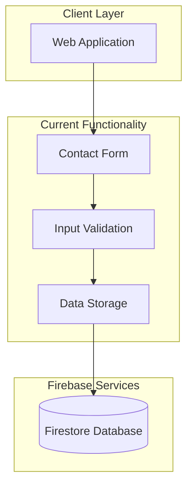
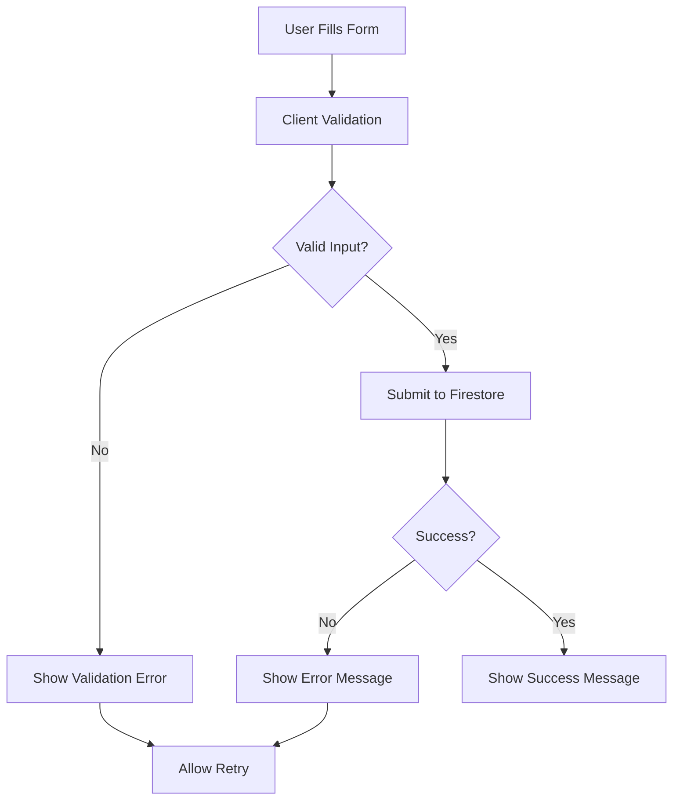

# API Requests Documentation

## Current Implementation

This document outlines the current API functionality for the Website14.com application. Currently, the application uses Firebase Firestore directly for contact form submissions.

## Current Architecture



## Current Firebase Operations

### **Contact Form Submission**

The application currently uses Firebase Firestore directly for contact form submissions.

#### **Submit Contact Form**
```javascript
// Current implementation in ContactChat.js
async submitToFirestore() {
  try {
    const docRef = await addDoc(collection(db, "contacts"), {
      name: this.userData.name,
      phone: this.userData.phone,
      email: this.userData.email,
      message: this.userData.message,
      timestamp: serverTimestamp()
    });
    return docRef.id;
  } catch (error) {
    console.error("Error submitting to Firestore:", error);
    throw error;
  }
}
```

**Parameters:**
- `name`: User's full name (string)
- `phone`: User's phone number (string)
- `email`: User's email address (string)
- `message`: User's inquiry or project description (string)
- `timestamp`: Server-generated timestamp

**Return Values:**
- `Promise<string>`: Document ID on success
- `Promise<Error>`: Error object on failure

## Current Data Flow

### **Contact Form Process**
1. **User Input**: User fills out contact form
2. **Validation**: Client-side validation of form data
3. **Submission**: Data sent directly to Firestore
4. **Confirmation**: Success message shown to user



## Current Validation Rules

### **Form Validation**
```javascript
// Current validation in ContactChat.js
const validationRules = {
  name: (value) => value.trim().length > 0 ? null : "Please enter your name",
  phone: (value) => value.trim().length > 0 ? null : "Please enter your phone number",
  email: (value) => {
    const emailRegex = /^[^\s@]+@[^\s@]+\.[^\s@]+$/;
    if (!value.trim()) return "Please enter your email address";
    if (!emailRegex.test(value)) return "Please enter a valid email address";
    return null;
  },
  message: (value) => value.trim().length > 0 ? null : "Please describe your inquiry"
};
```

## Current Error Handling

### **Error Response Format**
```javascript
// Current error handling
try {
  const docRef = await addDoc(collection(db, "contacts"), contactData);
  return { success: true, id: docRef.id };
} catch (error) {
  console.error("Error submitting to Firestore:", error);
  return { 
    success: false, 
    error: "Failed to submit contact form. Please try again." 
  };
}
```

### **Common Error Scenarios**
- **Network Error**: Connection to Firebase failed
- **Validation Error**: Invalid form data
- **Firestore Error**: Database write failed
- **Permission Error**: Firestore rules violation

## Current Security

### **Firestore Rules**
```javascript
rules_version = '2';
service cloud.firestore {
  match /databases/{database}/documents {
    match /contacts/{document} {
      allow create: if true;
      allow read, update, delete: if false;
    }
  }
}
```

### **Security Considerations**
- **Public Write**: Anyone can create contact submissions
- **No Read Access**: Public cannot read contact data
- **No Update/Delete**: Public cannot modify existing data
- **Input Validation**: Client-side validation only

## Current Implementation Details

### **Contact Form Structure**
The contact form uses a chat-like interface with step-by-step data collection:

1. **Name Collection**: User enters their full name
2. **Phone Collection**: User enters their phone number
3. **Email Collection**: User enters their email address
4. **Message Collection**: User describes their inquiry or project

### **Data Storage**
```javascript
// Contact document structure in Firestore
{
  id: "auto-generated",
  name: "John Doe",
  phone: "+1234567890",
  email: "john@example.com",
  message: "I need a website for my business",
  timestamp: "2024-01-15T10:30:00Z"
}
```

## Future API Considerations

### **Planned API Endpoints**
When expanding the application, consider these API patterns:

#### **Authentication API**
```javascript
// Future implementation
POST /auth/register
POST /auth/login
POST /auth/logout
```

#### **User Management API**
```javascript
// Future implementation
GET /users/profile
PUT /users/profile
PUT /users/password
```

#### **Project Management API**
```javascript
// Future implementation
POST /projects
GET /projects
GET /projects/{id}
PUT /projects/{id}
```

#### **Payment API**
```javascript
// Future implementation
POST /payments
GET /payments/{id}
GET /invoices
```

## Current Limitations

### **Functionality**
- **No REST API**: Direct Firebase operations only
- **No Authentication**: No user accounts or sessions
- **No Admin Access**: No way to view submitted contacts
- **No Email Integration**: No automated email responses

### **Technical**
- **Client-side Only**: No server-side processing
- **No Rate Limiting**: No request throttling
- **No Caching**: No response caching
- **No Analytics**: No API usage tracking

## Development Guidelines

### **Current Best Practices**
- **Input Validation**: Always validate on client-side
- **Error Handling**: Provide user-friendly error messages
- **Security**: Follow Firestore security rules
- **Performance**: Minimize database operations

### **Future Considerations**
- **API Gateway**: Implement proper REST API
- **Authentication**: Add user authentication
- **Rate Limiting**: Implement request throttling
- **Monitoring**: Add API usage analytics

This documentation reflects the current implementation and provides a foundation for future API development.
