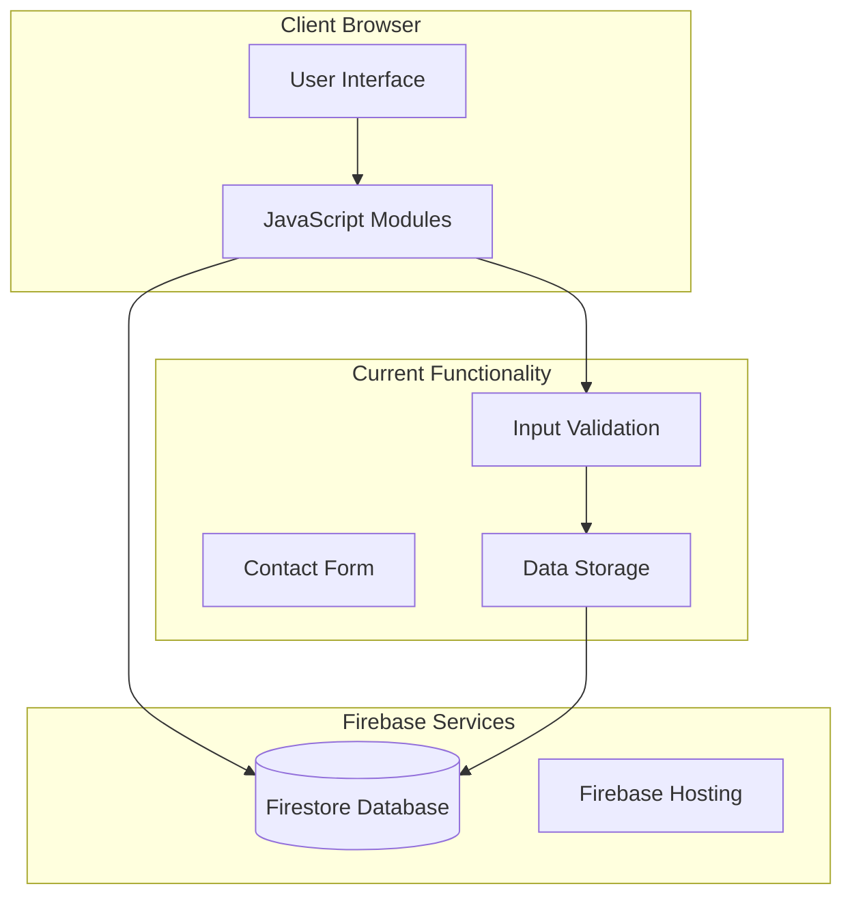
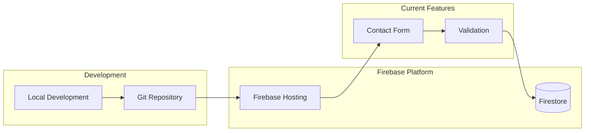

# Architecture Overview

## Current System Design

Website14.com is currently built as a static website with Firebase integration for contact form functionality. The system uses Firebase Firestore for data storage and Firebase Hosting for deployment.

## Current Architecture Components

### **Frontend Layer**
- **Static HTML Pages**: Core pages (Home, Contact, Services)
- **JavaScript Modules**: Basic Firebase integration and contact form handling
- **CSS Framework**: Tailwind CSS for responsive design
- **Progressive Enhancement**: Core functionality works without JavaScript

### **Backend Services (Firebase)**
- **Firestore Database**: NoSQL document database for contact submissions
- **Hosting**: Static site hosting
- **Authentication**: Not currently implemented (planned for future)

### **Current Integrations**
- **Firebase Firestore**: Contact form data storage
- **Firebase Hosting**: Website deployment

## Current Service Interactions



## Current Data Flow

### **Contact Form Flow**
1. **User Input**: User fills out contact form
2. **Validation**: Client-side validation of form data
3. **Submission**: Data sent to Firestore
4. **Confirmation**: Success message shown to user

### **Current User Journey**
1. **Landing**: User visits homepage
2. **Navigation**: User navigates to contact page
3. **Interaction**: User fills out contact form
4. **Submission**: Contact data stored in Firestore

## Current Security Architecture

### **Data Protection**
- **Firestore Rules**: Database-level security rules
- **HTTPS**: Encrypted data transmission
- **Input Validation**: Client-side validation
- **Public Read/Write**: Only contact form submissions allowed

### **Current Security Rules**
```javascript
rules_version = '2';
service cloud.firestore {
  match /databases/{database}/documents {
    match /contacts/{document} {
      allow create: if true;
      allow read, update, delete: if false;
    }
  }
}
```

## Current Technology Stack

### **Frontend**
- **HTML5**: Semantic markup
- **CSS3**: Tailwind CSS framework
- **JavaScript (ES6+)**: Modern JavaScript with modules
- **Progressive Web App**: Basic PWA capabilities

### **Backend**
- **Firebase Firestore**: NoSQL database
- **Firebase Hosting**: Static site hosting

### **Development**
- **Git**: Version control
- **Firebase CLI**: Deployment tools

## Current Deployment Architecture



## Current Implementation Details

### **Contact Form Implementation**
- **ContactChat Class**: Handles form interaction
- **Step-by-step Validation**: Progressive data collection
- **Firestore Integration**: Direct database writes
- **Error Handling**: Client-side error management

### **Current Pages**
- **Home Page**: Landing page with navigation
- **Contact Page**: Contact form with chat interface
- **Services Page**: Service information
- **Project Builder**: Basic project tool

## Performance Considerations

### **Current Optimization**
- **Static Assets**: Optimized images and CSS
- **Minimal JavaScript**: Lightweight client-side code
- **CDN**: Firebase Hosting CDN
- **Caching**: Browser caching for static assets

### **Current Monitoring**
- **Firebase Analytics**: Basic page view tracking
- **Error Logging**: Console error monitoring
- **Performance**: Core Web Vitals tracking

## Future Architecture Considerations

### **Planned Enhancements**
- **User Authentication**: Firebase Auth integration
- **Project Management**: Client portal functionality
- **Payment Processing**: Payment gateway integration
- **Admin Panel**: Content management system

### **Scalability Planning**
- **Database Optimization**: Proper indexing and queries
- **Caching Strategy**: Client and server-side caching
- **Load Balancing**: Firebase auto-scaling
- **Monitoring**: Advanced analytics and error tracking

## Current Limitations

### **Functionality**
- **No User Accounts**: No authentication system
- **No Admin Panel**: No content management
- **No Payment Processing**: No billing system
- **No Real-time Features**: No live chat or notifications

### **Technical**
- **Limited Backend Logic**: No server-side processing
- **No API**: No REST API endpoints
- **No File Upload**: No file storage system
- **No Email Integration**: No automated emails

## Development Workflow

### **Current Process**
1. **Local Development**: Edit files locally
2. **Testing**: Test contact form functionality
3. **Deployment**: Deploy to Firebase Hosting
4. **Monitoring**: Check for errors and performance

### **Version Control**
- **Git Repository**: Source code version control
- **Branch Strategy**: Simple main branch workflow
- **Deployment**: Direct deployment from main branch

This architecture provides a solid foundation for the current contact form functionality while being extensible for future enhancements.
