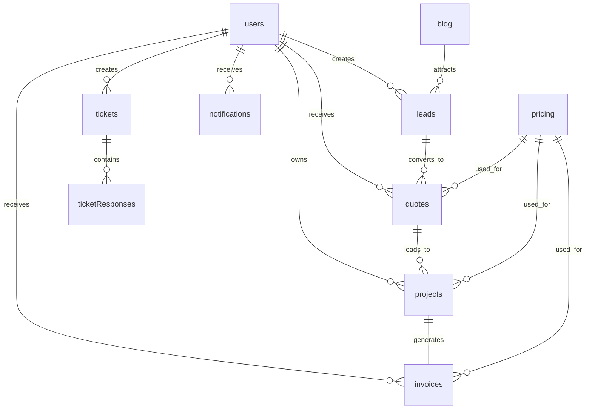
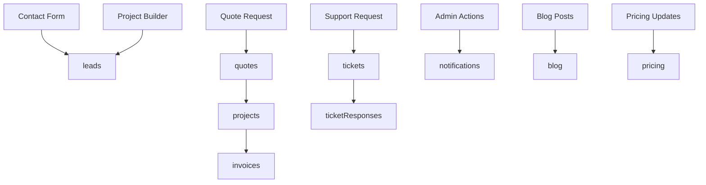

# Firebase Datastore Details

## Overview

Website14 uses Firebase Firestore as its primary database with the following collections to manage user data, leads, projects, support tickets, and content.

## Collections

### 1. `users`

**Purpose**: User authentication and profile management
**Key Fields**:

- `uid` (string): Firebase Auth UID
- `email` (string): User email address
- `role` (string): 'admin' or 'client'
- `displayName` (string): User's display name
- `createdAt` (timestamp): Account creation date
- `updatedAt` (timestamp): Last profile update

### 2. `leads`

**Purpose**: Contact form submissions and lead management
**Key Fields**:

- `userId` (string): Associated user UID (optional)
- `userEmail` (string): User email (optional)
- `name` (string): Contact name
- `email` (string): Contact email
- `phone` (string): Contact phone
- `message` (string): Lead message
- `status` (string): 'new', 'contacted', 'qualified', 'closed'
- `source` (string): 'website-form', 'project-builder', etc.
- `timestamp` (timestamp): Lead creation date
- `recaptchaToken` (string): reCAPTCHA verification token

### 3. `quotes`

**Purpose**: Project quotes and pricing estimates
**Key Fields**:

- `userId` (string): Client UID
- `userEmail` (string): Client email
- `businessName` (string): Business name
- `domain` (string): Domain name
- `packageType` (string): 'static', 'dynamic', 'ecommerce'
- `setupFee` (number): Initial setup cost
- `monthlyFee` (number): Monthly hosting fee
- `currency` (string): Pricing currency
- `status` (string): 'pending', 'accepted', 'rejected'
- `createdAt` (timestamp): Quote creation date

### 4. `projects`

**Purpose**: Active website development projects
**Key Fields**:

- `userId` (string): Client UID
- `userEmail` (string): Client email
- `businessName` (string): Business name
- `domain` (string): Domain name
- `businessType` (string): Type of business
- `packageType` (string): Selected package
- `status` (string): 'pending', 'active', 'completed'
- `setupFee` (number): Setup cost
- `monthlyFee` (number): Monthly fee
- `addons` (array): Selected add-ons
- `createdAt` (timestamp): Project creation date
- `updatedAt` (timestamp): Last update date

### 5. `invoices`

**Purpose**: Financial billing and invoicing
**Key Fields**:

- `projectId` (string): Associated project ID
- `userId` (string): Client UID
- `userEmail` (string): Client email
- `businessName` (string): Business name
- `invoiceNumber` (string): Unique invoice number
- `setupFee` (number): Setup cost
- `monthlyFee` (number): Monthly fee
- `currency` (string): Invoice currency
- `status` (string): 'pending', 'paid', 'overdue'
- `dueDate` (timestamp): Payment due date
- `createdAt` (timestamp): Invoice creation date
- `updatedAt` (timestamp): Last update date

### 6. `tickets`

**Purpose**: Customer support ticket system
**Key Fields**:

- `userId` (string): Client UID
- `userEmail` (string): Client email
- `subject` (string): Ticket subject
- `message` (string): Ticket description
- `priority` (string): 'low', 'medium', 'high'
- `category` (string): 'general', 'technical', 'billing'
- `status` (string): 'open', 'in-progress', 'resolved', 'closed'
- `createdAt` (timestamp): Ticket creation date
- `updatedAt` (timestamp): Last update date

### 7. `ticketResponses`

**Purpose**: Support ticket conversation threads
**Key Fields**:

- `ticketId` (string): Associated ticket ID
- `userId` (string): Response author UID
- `userEmail` (string): Response author email
- `message` (string): Response content
- `isAdmin` (boolean): Whether response is from admin
- `createdAt` (timestamp): Response creation date

### 8. `pricing`

**Purpose**: Dynamic pricing configuration
**Key Fields**:

- `currency` (string): Currency code (USD, EUR, etc.)
- `static` (object): Static website pricing
- `dynamic` (object): Dynamic website pricing
- `ecommerce` (object): E-commerce pricing
- `addons` (object): Add-on pricing
- `discounts` (object): Discount percentages
- `updatedAt` (timestamp): Last pricing update

### 9. `blog`

**Purpose**: Blog content management
**Key Fields**:

- `title` (string): Post title
- `content` (string): Post content (markdown)
- `excerpt` (string): Post summary
- `slug` (string): URL slug
- `tags` (array): Post tags
- `status` (string): 'draft', 'published'
- `publishedAt` (timestamp): Publication date
- `createdAt` (timestamp): Creation date
- `updatedAt` (timestamp): Last update date
- `seo` (object): SEO metadata

### 10. `notifications`

**Purpose**: System notifications
**Key Fields**:

- `userId` (string): Target user UID
- `title` (string): Notification title
- `message` (string): Notification content
- `type` (string): Notification type
- `read` (boolean): Read status
- `createdAt` (timestamp): Creation date

## Collection Relationships

## Security Rules Summary

- **users**: Users can read/write their own data, admins can read all
- **leads**: Authenticated users can create, users read own, admins read/write all
- **quotes**: Clients read own, admins read/write all
- **tickets**: Clients read/create own, admins read/write all
- **ticketResponses**: Users read/create for own tickets, admins read/write all
- **projects**: Clients read own, admins read/write all
- **invoices**: Clients read own, admins read/write all
- **pricing**: Public read, admin write only
- **blog**: Public read, admin write only
- **notifications**: Clients create, admins read/write all

## Data Flow

## Key Indexes Required

- `leads`: `timestamp` (descending)
- `quotes`: `userId`, `createdAt` (descending)
- `projects`: `userId`, `timestamp` (descending)
- `tickets`: `userId`, `timestamp` (descending)
- `ticketResponses`: `ticketId`, `createdAt` (ascending)
- `invoices`: `userId`, `createdAt` (descending)
- `blog`: `status`, `publishedAt` (descending)
- `pricing`: `currency`
