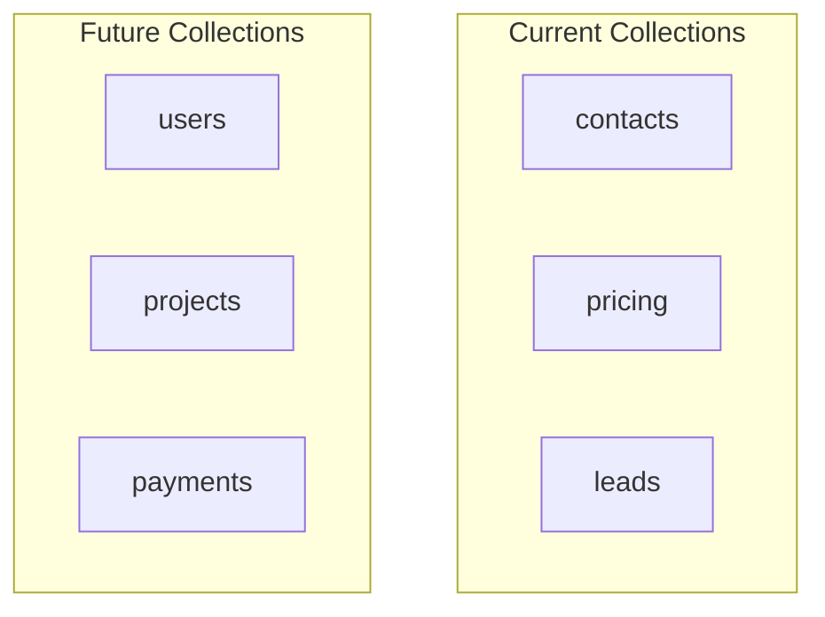
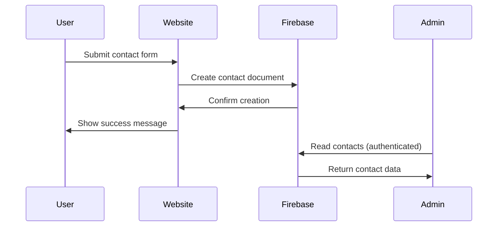
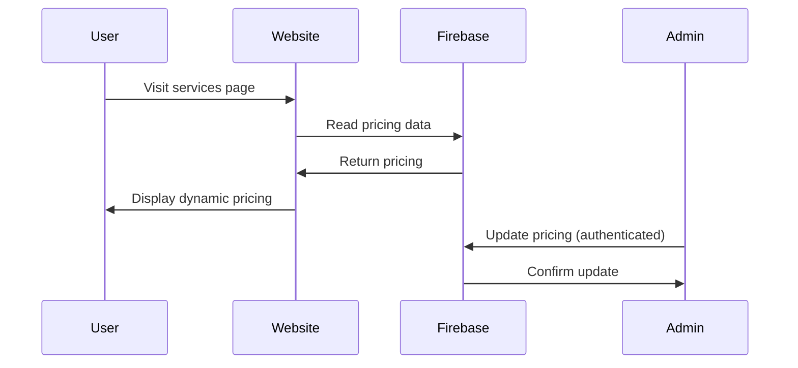
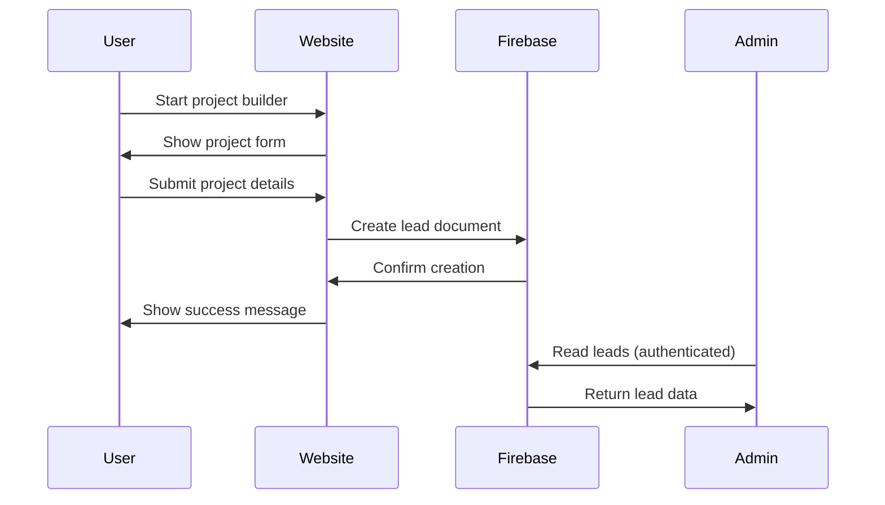

# Firebase Datastore Documentation

## Current Implementation

The Website14.com application currently uses Firebase Firestore with collections for contact form submissions, pricing management, and project leads.

## Collections Overview



## Current Collection Details

### **contacts**

```javascript
{
  id: "string", // Auto-generated by Firestore
  name: "string",
  phone: "string",
  email: "string",
  message: "string",
  timestamp: "timestamp", // Server timestamp
  status: "string" // Default: "new"
}
```

**Field Descriptions:**

- `name`: User's full name
- `phone`: User's phone number
- `email`: User's email address
- `message`: User's inquiry or project description
- `timestamp`: When the contact was submitted (server-generated)
- `status`: Contact status (default: "new")

### **pricing**

```javascript
{
  id: "string", // Auto-generated by Firestore
  currency: "string", // Currency code (USD, EUR, GBP, etc.)
  services: {
    "web-design": {
      basic: "number",
      standard: "number",
      premium: "number"
    },
    "web-development": {
      basic: "number",
      standard: "number", 
      premium: "number"
    },
    "seo": {
      basic: "number",
      standard: "number",
      premium: "number"
    },
    "maintenance": {
      basic: "number",
      standard: "number",
      premium: "number"
    }
  },
  lastUpdated: "timestamp", // Server timestamp
  isActive: "boolean" // Default: true
}
```

**Field Descriptions:**

- `currency`: Three-letter currency code (USD, EUR, GBP, INR, etc.)
- `services`: Object containing pricing for each service tier
- `lastUpdated`: When the pricing was last modified (server-generated)
- `isActive`: Whether this pricing configuration is active

### **leads**

```javascript
{
  id: "string", // Auto-generated by Firestore
  projectType: "string", // Type of project
  budget: "string", // Budget range
  timeline: "string", // Project timeline
  description: "string", // Project description
  contactInfo: {
    name: "string",
    email: "string",
    phone: "string"
  },
  timestamp: "timestamp", // Server timestamp
  status: "string" // Default: "new"
}
```

**Field Descriptions:**

- `projectType`: Type of project (website, e-commerce, etc.)
- `budget`: Budget range for the project
- `timeline`: Project timeline requirements
- `description`: Detailed project description
- `contactInfo`: Contact information object
- `timestamp`: When the lead was created (server-generated)
- `status`: Lead status (default: "new")

## Security Rules

### **Current Rules**

```javascript
rules_version = '2';
service cloud.firestore {
  match /databases/{database}/documents {
    // Allow anyone to create contact submissions (no authentication required)
    match /contacts/{document} {
      allow create: if true;
      // Allow read and update for authenticated admin users
      allow read, update: if request.auth != null && request.auth.token.email == 'contact@syedqutubuddin.in';
      // No delete access for anyone
      allow delete: if false;
    }
    
    // Allow project builder leads to be created and updated
    match /leads/{document} {
      allow create: if true;
      allow update: if true; // Allow updates for progressive data collection
      allow read, delete: if false; // Only allow creation/update, no read/delete for public
    }
    
    // Allow public read access to pricing, admin can update
    match /pricing/{document} {
      allow read: if true; // Public can read pricing
      allow write: if request.auth != null && request.auth.token.email == 'contact@syedqutubuddin.in';
    }
  }
}
```

## Data Flow Diagrams

### **Contact Form Flow**



### **Pricing Management Flow**



### **Project Builder Flow**



## Admin Dashboard Integration

### **Current Admin Features**

1. **Contact Management**
   - View all contact submissions
   - Update contact status
   - Filter by status and date

2. **Pricing Management**
   - Update pricing for all currencies
   - Manage service tiers
   - Control add-ons and extras

3. **Lead Management**
   - View project leads
   - Track project status
   - Manage client communications

## Future Enhancements

### **Planned Collections**

1. **users**
   - User authentication and profiles
   - Role-based access control
   - User preferences and settings

2. **projects**
   - Project tracking and management
   - Milestone tracking
   - File and asset management

3. **payments**
   - Payment processing records
   - Invoice management
   - Financial reporting

### **Security Enhancements**

1. **Enhanced Authentication**
   - Multi-factor authentication
   - Session management
   - IP-based access controls

2. **Data Protection**
   - Encryption at rest
   - Audit logging
   - Backup and recovery

## Performance Considerations

### **Current Optimizations**

1. **Indexing**
   - Composite indexes for queries
   - Optimized field selection
   - Efficient data structure

2. **Caching**
   - Client-side caching for pricing
   - Admin dashboard caching
   - Static asset optimization

3. **Security**
   - Minimal read/write permissions
   - Admin-only access for sensitive operations
   - Public read access for pricing data

## Troubleshooting

### **Common Issues**

1. **Authentication Errors**
   - Check admin email configuration
   - Verify Firebase project settings
   - Ensure proper security rules

2. **Data Loading Issues**
   - Check network connectivity
   - Verify Firestore permissions
   - Review console for errors

3. **Admin Access Problems**
   - Confirm Google authentication
   - Check admin email whitelist
   - Verify security rules configuration
