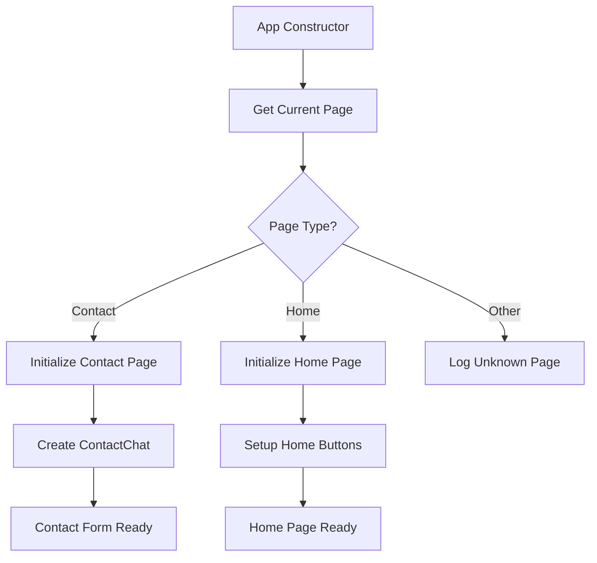
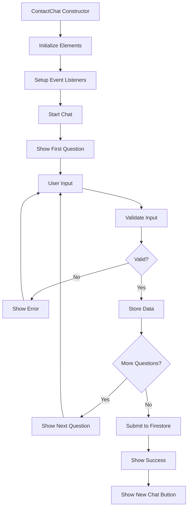

# Functions and Classes Documentation

## Current Implementation

This document outlines the current functions and classes in the Website14.com application. Currently, the application has a basic structure with contact form functionality.

## Current Classes

### **App**

Main application class that handles page initialization and routing.

```javascript
class App {
  constructor() {
    this.currentPage = this.getCurrentPage();
    this.initialize();
  }

  getCurrentPage() {
    const path = window.location.pathname;
    if (path.includes('contact.html')) return 'contact';
    return 'home';
  }

  initialize() {
    switch (this.currentPage) {
      case 'contact':
        this.initializeContactPage();
        break;
      case 'home':
        this.initializeHomePage();
        break;
      default:
        console.log('Unknown page:', this.currentPage);
    }
  }

  initializeContactPage() {
    try {
      new ContactChat();
      console.log('Contact chat initialized successfully');
    } catch (error) {
      console.error('Error initializing contact chat:', error);
    }
  }

  initializeHomePage() {
    this.setupHomePageButtons();
    console.log('Home page initialized successfully');
  }

  setupHomePageButtons() {
    const websiteBtn = document.getElementById('website-btn');
    const complexBtn = document.getElementById('complex-btn');

    if (websiteBtn) {
      websiteBtn.addEventListener('click', () => {
        window.location.href = 'contact.html';
      });
    }

    if (complexBtn) {
      complexBtn.addEventListener('click', () => {
        window.location.href = 'contact.html';
      });
    }
  }
}
```

**Parameters:**
- None (constructor)

**Return Values:**
- None (initializes page functionality)

**Page Initialization Flow:**


### **ContactChat**

Handles the contact form with a chat-like interface and Firebase integration.

```javascript
class ContactChat {
  constructor() {
    this.currentStep = 0;
    this.userData = {};
    this.chatMessages = document.getElementById('chat-messages');
    this.userInput = document.getElementById('user-input');
    this.sendBtn = document.getElementById('send-btn');
    this.newChatBtn = document.getElementById('new-chat-btn');

    this.steps = [
      {
        question: "Hi! I'm here to help you get in touch with our team. What's your name?",
        field: "name",
        validation: (value) => value.trim().length > 0 ? null : "Please enter your name"
      },
      {
        question: "Great! What's your phone number?",
        field: "phone",
        validation: (value) => value.trim().length > 0 ? null : "Please enter your phone number"
      },
      {
        question: "Perfect! What's your email address?",
        field: "email",
        validation: (value) => {
          const emailRegex = /^[^\s@]+@[^\s@]+\.[^\s@]+$/;
          if (!value.trim()) return "Please enter your email address";
          if (!emailRegex.test(value)) return "Please enter a valid email address";
          return null;
        }
      },
      {
        question: "Finally, what would you like to contact us about? Please describe your project or inquiry.",
        field: "message",
        validation: (value) => value.trim().length > 0 ? null : "Please describe your inquiry"
      }
    ];

    this.initializeEventListeners();
    this.start();
  }

  initializeEventListeners() {
    this.sendBtn.addEventListener('click', () => this.handleUserInput());
    this.userInput.addEventListener('keypress', (e) => {
      if (e.key === 'Enter') {
        this.handleUserInput();
      }
    });
    this.newChatBtn.addEventListener('click', () => this.resetChat());
  }

  addMessage(text, isUser = false) {
    const messageDiv = document.createElement('div');
    messageDiv.className = `flex ${isUser ? 'justify-end' : 'justify-start'}`;

    const messageBubble = document.createElement('div');
    messageBubble.className = `max-w-xs lg:max-w-md px-4 py-3 rounded-lg ${
      isUser ? 'bg-gray-800 text-white' : 'bg-gray-100 text-gray-800'
    }`;
    messageBubble.textContent = text;

    messageDiv.appendChild(messageBubble);
    this.chatMessages.appendChild(messageDiv);
    this.chatMessages.scrollTop = this.chatMessages.scrollHeight;
  }

  showCurrentStep() {
    if (this.currentStep < this.steps.length) {
      this.addMessage(this.steps[this.currentStep].question);
      this.userInput.disabled = false;
      this.sendBtn.disabled = false;
      this.userInput.focus();
    }
  }

  async handleUserInput() {
    const input = this.userInput.value.trim();
    if (!input) return;

    this.addMessage(input, true);
    this.userInput.value = '';

    const currentStepData = this.steps[this.currentStep];
    const validationError = currentStepData.validation(input);

    if (validationError) {
      this.addMessage(validationError);
      return;
    }

    this.userData[currentStepData.field] = input;
    this.currentStep++;

    if (this.currentStep >= this.steps.length) {
      await this.submitToFirestore();
    } else {
      this.showCurrentStep();
    }
  }

  async submitToFirestore() {
    try {
      this.addMessage("Thank you! I'm submitting your information now...");
      this.userInput.disabled = true;
      this.sendBtn.disabled = true;

      const docRef = await addDoc(collection(db, "contacts"), {
        name: this.userData.name,
        phone: this.userData.phone,
        email: this.userData.email,
        message: this.userData.message,
        timestamp: serverTimestamp()
      });

      this.addMessage("Perfect! Your message has been sent successfully. We'll get back to you soon!");
      this.showNewChatButton();
    } catch (error) {
      console.error("Error submitting to Firestore:", error);
      this.addMessage("Sorry, there was an error submitting your message. Please try again.");
      this.userInput.disabled = false;
      this.sendBtn.disabled = false;
    }
  }

  resetChat() {
    this.currentStep = 0;
    this.userData = {};
    this.chatMessages.innerHTML = '';
    this.userInput.disabled = false;
    this.sendBtn.disabled = false;
    this.newChatBtn.style.display = 'none';
    this.start();
  }

  showNewChatButton() {
    this.newChatBtn.style.display = 'block';
  }

  start() {
    this.addMessage("Welcome! I'm here to help you get in touch with our team.");
    this.showCurrentStep();
  }
}
```

**Parameters:**
- None (constructor)

**Return Values:**
- None (manages chat interface and form submission)

**Contact Form Flow:**


## Current Utility Functions

### **Form Validation**

```javascript
// Validation functions used in ContactChat
const validationRules = {
  name: (value) => value.trim().length > 0 ? null : "Please enter your name",
  phone: (value) => value.trim().length > 0 ? null : "Please enter your phone number",
  email: (value) => {
    const emailRegex = /^[^\s@]+@[^\s@]+\.[^\s@]+$/;
    if (!value.trim()) return "Please enter your email address";
    if (!emailRegex.test(value)) return "Please enter a valid email address";
    return null;
  },
  message: (value) => value.trim().length > 0 ? null : "Please describe your inquiry"
};
```

**Parameters:**
- `value`: String value to validate

**Return Values:**
- `null`: Validation passed
- `string`: Error message if validation failed

### **Firebase Integration**

```javascript
// Firebase configuration and operations
import { db } from '../modules/firebase-config.js';
import { collection, addDoc, serverTimestamp } from 'https://www.gstatic.com/firebasejs/10.7.1/firebase-firestore.js';

// Submit contact data to Firestore
async function submitContact(contactData) {
  try {
    const docRef = await addDoc(collection(db, "contacts"), {
      ...contactData,
      timestamp: serverTimestamp()
    });
    return { success: true, id: docRef.id };
  } catch (error) {
    console.error("Error submitting to Firestore:", error);
    return { success: false, error: error.message };
  }
}
```

**Parameters:**
- `contactData`: Object containing contact information

**Return Values:**
- `Promise<Object>`: Success status and document ID or error

## Current Error Handling

### **Error Handling in ContactChat**

```javascript
// Error handling for form submission
async submitToFirestore() {
  try {
    // ... submission logic
    this.addMessage("Perfect! Your message has been sent successfully.");
  } catch (error) {
    console.error("Error submitting to Firestore:", error);
    this.addMessage("Sorry, there was an error submitting your message. Please try again.");
    this.userInput.disabled = false;
    this.sendBtn.disabled = false;
  }
}
```

**Error Scenarios:**
- **Network Error**: Connection to Firebase failed
- **Validation Error**: Invalid form data
- **Firestore Error**: Database write failed
- **Permission Error**: Firestore rules violation

## Current Implementation Details

### **Page Routing**

```javascript
// Current page detection logic
getCurrentPage() {
  const path = window.location.pathname;
  if (path.includes('contact.html')) return 'contact';
  return 'home';
}
```

### **Event Handling**

```javascript
// Current event listener setup
initializeEventListeners() {
  this.sendBtn.addEventListener('click', () => this.handleUserInput());
  this.userInput.addEventListener('keypress', (e) => {
    if (e.key === 'Enter') {
      this.handleUserInput();
    }
  });
  this.newChatBtn.addEventListener('click', () => this.resetChat());
}
```

## Current Limitations

### **Functionality**
- **No User Authentication**: No login/logout functionality
- **No Admin Panel**: No way to view submitted contacts
- **No Email Integration**: No automated email responses
- **No File Upload**: No file attachment capability

### **Technical**
- **Client-side Only**: No server-side processing
- **No Caching**: No response caching
- **No Analytics**: No usage tracking
- **No Error Recovery**: Limited error handling

## Future Considerations

### **Planned Classes**
When expanding the application, consider these classes:

```javascript
// Future class examples
class AuthenticationManager {
  // User authentication and session management
}

class UserManager {
  // User profile and data management
}

class ProjectManager {
  // Project creation and management
}

class PaymentManager {
  // Payment processing and billing
}
```

### **Planned Functions**
```javascript
// Future utility functions
const validateEmail = (email) => {};
const formatPhoneNumber = (phone) => {};
const sanitizeInput = (input) => {};
const handleApiError = (error) => {};
```

This documentation reflects the current implementation and provides a foundation for future development.
